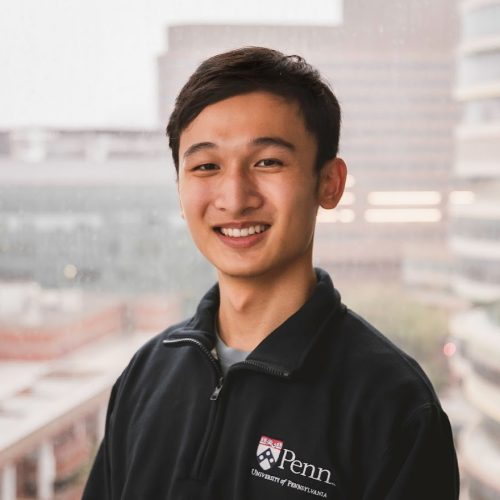

---
# Feel free to add content and custom Front Matter to this file.
# To modify the layout, see https://jekyllrb.com/docs/themes/#overriding-theme-defaults

layout: home
---

<h1 class="hero-name">Stephan Xie</h1>

  
  

    <a href="https://github.com/stephofx" title="GitHub" aria-label="GitHub">
      <svg viewBox="0 0 16 16" width="20" height="20"><path fill="currentColor" d="M8 0C3.58 0 0 3.58 0 8c0 3.54 2.29 6.53 5.47 7.59.4.07.55-.17.55-.38 0-.19-.01-.82-.01-1.49-2.01.37-2.53-.49-2.69-.94-.09-.23-.48-.94-.82-1.13-.28-.15-.68-.52-.01-.53.63-.01 1.08.58 1.23.82.72 1.21 1.87.87 2.33.66.07-.52.28-.87.51-1.07-1.78-.2-3.64-.89-3.64-3.95 0-.87.31-1.59.82-2.15-.08-.2-.36-1.02.08-2.12 0 0 .67-.21 2.2.82.64-.18 1.32-.27 2-.27.68 0 1.36.09 2 .27 1.53-1.04 2.2-.82 2.2-.82.44 1.1.16 1.92.08 2.12.51.56.82 1.27.82 2.15 0 3.07-1.87 3.75-3.65 3.95.29.25.54.73.54 1.48 0 1.07-.01 1.93-.01 2.2 0 .21.15.46.55.38A8.013 8.013 0 0016 8c0-4.42-3.58-8-8-8z"/></svg>
    </a>
    <a href="https://twitter.com/stephofx" title="Twitter / X" aria-label="Twitter">
      <svg viewBox="0 0 1200 1227" width="18" height="18"><path fill="currentColor" d="M714.163 519.284L1160.89 0H1055.03L667.137 450.887L357.328 0H0L468.492 681.821L0 1226.37H105.866L515.491 750.218L842.672 1226.37H1200L714.137 519.284H714.163ZM569.165 687.828L521.697 619.934L144.011 79.6944H306.615L611.412 515.685L658.88 583.579L1055.08 1150.3H892.476L569.165 687.854V687.828Z"/></svg>
    </a>
    <a href="https://scholar.google.com/citations?user=cJccBL0AAAAJ&hl=en" title="Google Scholar" aria-label="Google Scholar">
      <svg viewBox="0 0 24 24" width="20" height="20"><path fill="currentColor" d="M5.242 13.769L0 9.5 12 0l12 9.5-5.242 4.269C17.548 11.249 14.978 9.5 12 9.5c-2.977 0-5.548 1.748-6.758 4.269zM12 10a7 7 0 1 0 0 14 7 7 0 0 0 0-14z"/></svg>
    </a>
    <a href="https://www.linkedin.com/in/stephanxie/" title="LinkedIn" aria-label="LinkedIn">
      <svg viewBox="0 0 24 24" width="20" height="20"><path fill="currentColor" d="M20.447 20.452h-3.554v-5.569c0-1.328-.027-3.037-1.852-3.037-1.853 0-2.136 1.445-2.136 2.939v5.667H9.351V9h3.414v1.561h.046c.477-.9 1.637-1.85 3.37-1.85 3.601 0 4.267 2.37 4.267 5.455v6.286zM5.337 7.433c-1.144 0-2.063-.926-2.063-2.065 0-1.138.92-2.063 2.063-2.063 1.14 0 2.064.925 2.064 2.063 0 1.139-.925 2.065-2.064 2.065zm1.782 13.019H3.555V9h3.564v11.452zM22.225 0H1.771C.792 0 0 .774 0 1.729v20.542C0 23.227.792 24 1.771 24h20.451C23.2 24 24 23.227 24 22.271V1.729C24 .774 23.2 0 22.222 0h.003z"/></svg>
    </a>
  

Hi! I'm Stephan, a second-year PhD student in the [Machine Learning Department](https://ml.cmu.edu) at Carnegie Mellon University advised by [Ameet Talwalkar](https://www.cs.cmu.edu/~atalwalk/), and supported by the NSF GRFP. I also collaborate with [Datadog AI Research](https://www.datadoghq.com/blog/ai/) on multimodal modeling and software agents. 

I'm broadly interested in topics within agents, multimodality, reliable decision-making, and translational impact of ML.

Previously, I did my undergrad at the University of Pennsylvania [School of Engineering and Applied Sciences](https://www.seas.upenn.edu/) studying Computer Science and Mathematical Economics. At Penn I was fortunate to work with [Aaron Roth](https://www.cis.upenn.edu/~aaroth/) on calibration and learning theory, [Kevin He](https://www.kevinhe.net) on social learning, as well as Yi Xing and Robert Wang at the [Xing Lab](https://xinglab.org/) on computational biology.

Extracurriculars

In my free time in undergrad I danced, choreographed, and filmed for [Pan-Asian Dance Troupe](https://www.youtube.com/@PanAsianDanceTroupe/videos), and I am a long-time wushu student and enthusiast. I also [compose](https://musescore.com/user/30731574) and play instrumental [music](https://www.youtube.com/playlist?list=PLL7ewZWw3-y07CWUQkstSa4rG5a3kQgFT) (formerly with Penn Chamber), primarily for the piano.

<h2 class="section-heading">News</h2>

<ul class="news-list">
  <li>Jun 2025Started as a Research Intern at Datadog in NYC.</li>
  <li>Aug 2024Started my PhD at CMU!</li>
  <li>Apr 2024Awarded the <a href="https://blog.cis.upenn.edu/penn-students-awarded-2024-nsf-grfp/">2024 NSF GRFP Fellowship</a>!</li>
  <li>Feb 2024Honored to receive the 2024 <a href="https://www.cis.upenn.edu/news/awards/">Albert P. Godsho Engineering Award</a>!</li>
</ul>

<h2 class="section-heading">Publications</h2>

  
<a href="https://openreview.net/pdf?id=C4AXJvsgT6">ARFBench: Benchmarking Multimodal Time Series Reasoning for Software Incident Response</a>

  
International Conference on Learning Representations (ICLR) Workshop on Time Series in the Age of Large Models (TSALM), 2026 

  
Spotlight Presentation

  
<strong>Stephan Xie</strong>, Ben Cohen, Mononito Goswami, Junhong Shen, Emaad Khwaja, Chenghao Liu, David Asker, Othmane Abou-Amal, Ameet Talwalkar

  
<a href="https://arxiv.org/abs/2505.14766">This Time is Different: An Observability Perspective on Time Series Foundation Models</a>

  
Neural Information Processing Systems (NeurIPS), 2025 &middot; <a href="https://www.datadoghq.com/blog/ai/toto-boom-unleashed/">[Blog Post]</a>

  
Ben Cohen, Emaad Khwaja, Youssef Doubli, Salahidine Lemaachi, Chris Lettieri, Charles Masson, Hugo Miccinilli, Elise Ram&eacute;, Qiqi Ren, Afshin Rostamizadeh, Jean Ogier du Terrail, Anna-Monica Toon, Kan Wang, <strong>Stephan Xie</strong>, Zongzhe Xu, Viktoriya Zhukova, David Asker, Ameet Talwalkar, Othmane Abou-Amal

  
<a href="https://arxiv.org/abs/2310.17651">High-Dimensional Prediction for Sequential Decision Making</a>

  
International Conference on Machine Learning (ICML), 2025 &middot; <a href="https://www.let-all.com/blog/2024/03/13/calibration-for-decision-making-a-principled-approach-to-trustworthy-ml/">[Blog Post]</a>

  
Oral Presentation

  
Georgy Noarov, Ramya Ramalingam, Aaron Roth, <strong>Stephan Xie</strong>

  
<a href="https://www.science.org/doi/10.1126/sciadv.abq5072">ESPRESSO: Robust discovery and quantification of transcript isoforms from error-prone long-read RNA-seq data</a>

  
Science Advances, 2023

  
Yuan Gao, Feng Wang, Robert Wang, Eric Kutschera, Yang Xu, <strong>Stephan Xie</strong>, Yuanyuan Wang, Kathryn E. Kadash-Edmondson, Lan Lin, Yi Xing

<h2 class="section-heading">Teaching</h2>
<ul>
  <li><a href="https://andrejristeski.github.io/10708S26/">10-708 Probabilistic Graphical Models (Spring 2026)</a></li>
</ul>
